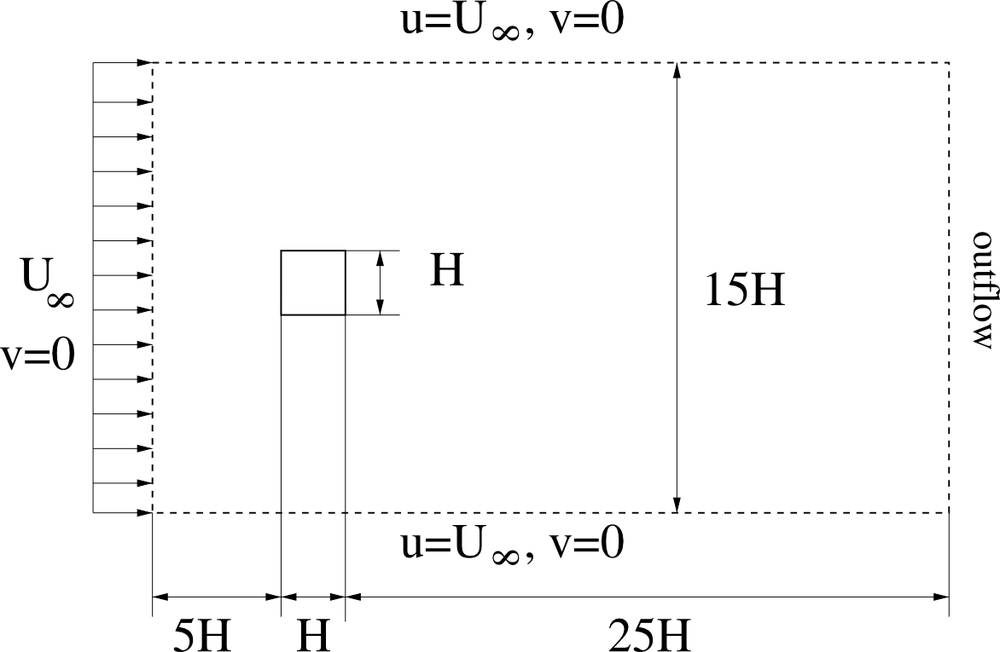

.. _introduction:

About this document
===================

This documentation is a result of solving the programming example for the
lecture *Numerical Methods in Fluid Mechanics and Heat Transfer (LV-Nr.: 321.023
VO, WS 2012/13)*.

It was written by Bence Somogyi (matr #: 1231273, somogyi@ivt.tugraz.at)

Description of the project
==========================

English translation of the descrition is given as:

Numerical simulation of laminar flow around an infinitely long cylinder of
square cross section (with edge length H) has to be performed. The problem can
be described by the two-dimensional laminar incompressible
(:math:`\rho = const`) Navier-Stokes equations:

.. math::

    \frac{\partial u}{\partial x} + \frac{\partial v}{\partial y} &= 0 \\
    \frac{\partial u}{\partial t} + u \frac{\partial u}{\partial x} +
    v \frac{\partial u}{\partial y} &=
    -\frac{1}{\rho} \frac{\partial p}{\partial x} + \nu \left(
    \frac{\partial^2 u}{\partial x^2} + \frac{\partial^2 u}{\partial y^2}
    \right) \\
    \frac{\partial v}{\partial t} + u \frac{\partial v}{\partial x} +
    v \frac{\partial v}{\partial y} &=
    -\frac{1}{\rho} \frac{\partial p}{\partial y} + \nu \left(
    \frac{\partial^2 v}{\partial x^2} + \frac{\partial^2 v}{\partial y^2}
    \right)

Dimensions of the computational domain and the associated boundary conditions are
shown below:

Tasks
-----

* solution of the equations in a non-dimensional form using :math:`H` and
  :math:`U_{\infty}` as characteristic values.

* second order finite-volume discretization in space and time (explicit)

* implicit solution of diffusion terms with suitable solution methods for linear
  systems

* numerical simulation of the flow field for :math:`Re = U_{\infty} * H / \nu = 200`
  to reach a statistcal steady state solution. Continuity shall be ensured via
  the solution of the Poisson equation. The Poisson equation shall be solved by
  a suitable dircet method.

* documentation of all the actions and results.
