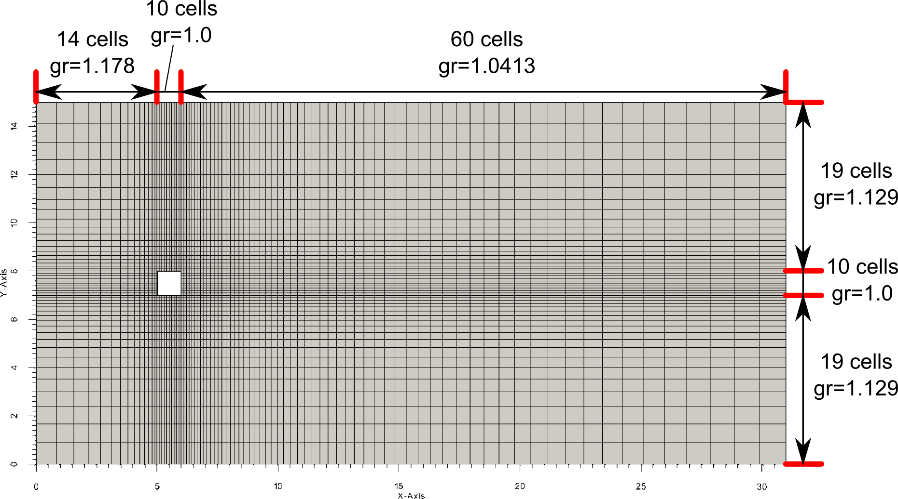
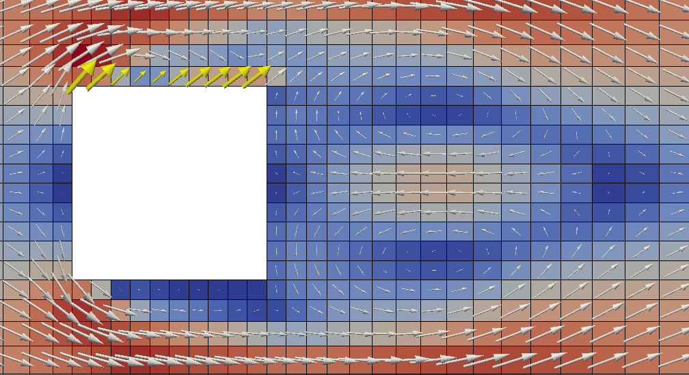
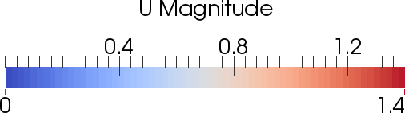
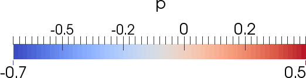

.. _solution:

Solution of the square cylinder problem
=======================================

* :ref:`grid`

* :ref:`description`

 * :ref:`readmesh`

 * :ref:`createfields`

 * :ref:`setre`

 * :ref:`seteq`

 * :ref:`storelapl`

 * :ref:`storelu`

 * :ref:`startiter`

  * :ref:`updatebnd`

  * :ref:`inducevortex`

  * :ref:`momimex`

  * :ref:`solvemom`

  * :ref:`rhiechow`

  * :ref:`pcorr`

  * :ref:`correctfields`

 * :ref:`monitor`

* :ref:`results`

.. _grid:

Computational grid
------------------

To save computational time the following block structured mesh was created 
for the square cylinder example with dimensions according to the project
description. The mesh consists of 3932 hexahedron cells. The mesh, cell numbers
in the blocks and growth rates (*gr*) are shown on the following picture:

.. _description:

Description of script used for the calculation
----------------------------------------------

(The complete :ref:`squarecylinderscript`)

.. _readmesh:

1. Reading mesh
^^^^^^^^^^^^^^^

The first important step is the loading of the mesh from a subdirectory of the
"_MESH" directory. Additionaly cell volumes and face areas are saved as vectors:

.. literalinclude:: ../squareCylinderNonDim.py
    :lines: 37-40

.. _createfields:

2. Creating fields
^^^^^^^^^^^^^^^^^^

* Five volume fields are created: pressure (*p*), pressure correction
  (*p_corr*), :math:`\rho` (*rho*), :math:`\frac{1}{\rho}` (*one_over_rho*)
  as :class:`pyCFD_fields.fields.ScalarField` and velocity (*U*) as 
  :class:`pyCFD_fields.fields.VectorField`. For pressure, pressure correction
  and velocity appropriate boundary conditions are set. The fields *U* and *p*
  represent the non dimensional fields as described in :ref:`nondim`.

* Additionaly the *p_old* and *U_old* fields are also created as copies of the
  original *p* and *U* fields. *U_old* is used in the IMEX scheme and in the
  Rhie-Chow interpolation, while *p_old* in the IMEX scheme.

* Pressure and correction pressure are initialized with the value of :math:`0`, 
  while the velocity with the vector :math:`\left( 1, 0, 0 \right)`.

* Two fields are created for the current and old values of mass fluxes
  (*m_dot* and *m_dot_old*) with
  :class:`pyCFD_fields.calculated_fields.MassFlux`.

.. literalinclude:: ../squareCylinderNonDim.py
   :lines: 42-80

.. note::

    Patches are initialized with *fixedValue* type and :math:`0` value.

.. note::

    The patch *frontAndRear* represents the patches towards the independent
    third direction (the flow around a square cylinder problem is calculated in
    2D, *z* direction is skipped).

.. _setre:

3. Set Re number and timestep
^^^^^^^^^^^^^^^^^^^^^^^^^^^^^

* Reynolds number is set to 200

* Set start time, time step and timesteps for saving .vtu output. During the
  calculation the following restarts were performed and new settings were
  applied:

 * | **1st run upto t*=5**
   | timestep:
   |     - ``upto t*=00.250: dt*=0.025``
   |     - ``upto t*=02.000: dt*=0.050``
   | IMEX: True

 * | **2nd run upto t*=80.0**
   | timestep:
   |     - ``upto t*=05.000: dt*= 0.100``
   |     - ``upto t*=05.100: dt*= 0.005``
   |     - ``upto t*=05.575: dt*= 0.025``
   |     - ``upto t*=80.000: dt*= 0.050``
   | IMEX: True
   | vortex shedding induced in the period: 5.000 < t* < 5.075

.. literalinclude:: ../squareCylinderNonDim.py
   :lines: 82-83

.. literalinclude:: ../squareCylinderNonDim.py
   :lines: 88-107

.. _seteq:

4. Set up solvers for the equations
^^^^^^^^^^^^^^^^^^^^^^^^^^^^^^^^^^^

* The momentum equation is created as
  :class:`pyCFD_operators.generic_equation.GenericVectorEquation`. For solving
  the linear equation systems the Gauss-Seidel
  solver (:class:`pyCFD_linear_solvers.linear_solvers.gs`) was applied with an
  under relaxation factor :math:`\lambda_m = 0.7`

* The pressure correction equation is created as
  :class:`pyCFD_operators.generic_equation.GenericScalarEquation`.
  For solving the linear equation systems the direct solver using LU
  decomposition (:class:`pyCFD_linear_solvers.linear_solvers.lu_solver_plu`) was
  applied with no under relaxation.

* Under relaxation of the pressure and velocity corrections was set to
  :math:`\lambda_p = 1.0` to ensure mass conservation of the transient process.

.. literalinclude:: ../squareCylinderNonDim.py
   :lines: 113-116

.. _storelapl:

5. Calculate and store coefficient matrix of laplace terms
^^^^^^^^^^^^^^^^^^^^^^^^^^^^^^^^^^^^^^^^^^^^^^^^^^^^^^^^^^

Coefficient matrix of the laplace terms both in the momentum and pressure
correction matrix are not changing during this calculation therefore they are
calculated and stored in advance. The matrices are stored using operator
objects: :class:`pyCFD_operators.implicit_operators.LaplaceVec` for the momentum
equation and :class:`pyCFD_operators.implicit_operators.Laplace` for the
pressure correction equation.

.. literalinclude:: ../squareCylinderNonDim.py
   :lines: 137-139

.. _storelu:

6. Calculate and store LU decomposition for the pressure equation
^^^^^^^^^^^^^^^^^^^^^^^^^^^^^^^^^^^^^^^^^^^^^^^^^^^^^^^^^^^^^^^^^

The LU solver can use the pre-calculated lower and upper triangle matrices,
therefore these are calculated and stored in advance. The matrices P,L and U are
stored in *p_corr_eq* of type
:class:`pyCFD_operators.generic_equation.GenericScalarEquation` in the variables
*p*, *l* and *u*. LU decomposition is calculated in
:class:`pyCFD_linear_solvers.linear_solvers.lu_decomp`.

.. literalinclude:: ../squareCylinderNonDim.py
   :lines: 141-149

.. _startiter:

7. Start time iteration loop
^^^^^^^^^^^^^^^^^^^^^^^^^^^^

.. _updatebnd:

7.1 Update boundary conditions and mass fluxes
"""""""""""""""""""""""""""""""""""""""""""""

* boundary conditions are updated (update values at fixedGradient type
  boundaries)

* coefficient matrix elements are reset to 0

* right hand side values are reset to 0

* mass flux is re-calculated

.. literalinclude:: ../squareCylinderNonDim.py
   :lines: 167-170

.. _inducevortex:

7.2 Induce vortex shedding at a specified time
""""""""""""""""""""""""""""""""""""""""""""""

Vortex shedding induced with applying artificial velocity values over the square
cylinder. These vectors are highlighted with yellow color on the image below
(the image shows the velocity distribution after the iteration step t*=5.500):

Artificial velocity values were applied between 5.000 < t* < 5.075 using
:class:`pyCFD_fields.initialization.init_cell_values_in_box`. The initialization
value was :math:`\left(1, 1, 0 \right)`.

.. literalinclude:: ../squareCylinderNonDim.py
   :lines: 172-174

.. _momimex:

7.3 Assemble momentum predictor equation using a 2nd order IMEX scheme
""""""""""""""""""""""""""""""""""""""""""""""""""""""""""""""""""""""

The momentum equation is solved in the form as previously written in
:ref:`threedvectorform`:

.. math::

    \frac{\partial \vec{v}^*}{\partial t^*} + \vec{v}^* \cdot \nabla \vec{v}^* =
    -\nabla p^* + \frac{1}{Re} \cdot \Delta\left( \vec{v}^* \right)

* According to Ascher et al 1995 (Ascher, Ruth, Wetton: *IMPLICIT-EXPLICIT
  METHODS FOR TIME-DEPENDENT PARTIAL DIFFERENTIAL EQUATIONS*, SIAM J. NUMER.
  ANAL., Vol. 32, No. 3, pp. 797--823, June 1995) a second order accurate
  IMplicit-EXplicit scheme is constructed using the explicit Adams-Bashforth
  scheme for the convection (*C*) and gradient (*G*) terms and the implicit
  Crank-Nicholson scheme for the diffusion term (*D*).
  
.. math::
        
      \frac{U^{n+1}-U^n}{\delta t} + \frac{3}{2} C\left(U^n\right)
      -\frac{1}{2} C\left(U^{n-1}\right) - \frac{\nu}{2} D\left(U^{n+1}\right)
      - \frac{\nu}{2} D\left(U^{n}\right) \\
      + \frac{3}{2} \frac{1}{\rho} 
      G\left(p^n\right) - \frac{1}{2} \frac{1}{\rho} G\left(p^{n-1}\right) = 0

* The time derivative term :math:`\frac{U^{n+1}-U^n}{\delta t}` is represented
  by the Euler operator: :class:`pyCFD_operators.implicit_operators.DdtEulerVec`
  .
  
.. literalinclude:: ../squareCylinderNonDim.py
   :lines: 194

* A :class:`pyCFD_fields.fields.ScalarField` (*Dt*) is created in which the
  implicit conribution of the transient term is saved. This field is used
  later in the Rhie-Chow interpolation.
  
.. literalinclude:: ../squareCylinderNonDim.py
   :lines: 195-196

* The term :math:`C\left(U^n\right)` is represented by
  :class:`pyCFD_operators.explicit_operators.DivergenceVec` using the 
  :class:`pyCFD_fields.calculated_fields.HRSFaceValue.MINMOD` scheme for 
  calculating the surface values of *U*.
  
.. literalinclude:: ../squareCylinderNonDim.py
   :lines: 197

* The term :math:`C\left(U^{n-1}\right)` is represented by
  :class:`pyCFD_operators.explicit_operators.DivergenceVec` using the
  :class:`pyCFD_fields.calculated_fields.HRSFaceValue.MINMOD` scheme for
  calculating the surface values of *U*. This operator is applied using the old
  velocity field *U_old* and the old mass flux field *m_dot_old*.
  
.. literalinclude:: ../squareCylinderNonDim.py
   :lines: 198

* The term :math:`D\left(U^{n+1}\right)` is represented by the 
  :class:`pyCFD_operators.implicit_operators.LaplaceVec` operator. The
  coefficient matrix of this term is not calculated, it is added from the
  previously saved variable *U_lapl* (see :ref:`storelapl`).
  
.. literalinclude:: ../squareCylinderNonDim.py
   :lines: 200-201

* The term :math:`D\left(U^{n}\right)` is represented by the
  :class:`pyCFD_operators.explicit_operators.LaplaceVec` operator.
  
.. literalinclude:: ../squareCylinderNonDim.py
   :lines: 202

* The pressure gradient terms are represented by the explicit gradient operator
  :class:`pyCFD_operators.explicit_operators.Gradient` with the factor
  :math:`\frac{1}{\rho}` (*one_over_rho*). The term
  :math:`G\left(p^{n-1}\right)` is applied for the old pressure field *p_old*.

.. literalinclude:: ../squareCylinderNonDim.py
   :lines: 203-204

The whole code section:

.. literalinclude:: ../squareCylinderNonDim.py
   :lines: 188-203

.. _solvemom:

7.4 Solve momentum equation and check divergence
""""""""""""""""""""""""""""""""""""""""""""""""

* The momentum is solved, old field values are overwritten.

* The mass flux *m_dot* is updated.

* The old mass flux *m_dot_old* is overwritten

.. literalinclude:: ../squareCylinderNonDim.py
   :lines: 205-213

.. _rhiechow:

7.5 Correct :math:`\dot{m}` (*m_dot*) with Rhie-Chow interpolation
""""""""""""""""""""""""""""""""""""""""""""""""""""""""

* According to Darwish et al 2000 (Darwish, Moukalled: *The Rhie-Chow
  Interpolation Revisited*, Int. J. Numer. Meth. Fluids 2000; 00:1-6) the Rhie-
  Chow interpolation is applied for :math:`\dot{m}`. The Rhie-Chow interpolated
  face velocity can be written as:
  
  .. math::

        u_f = \overline{u} - \overline{\frac{V}{a^t+a^{CD}}}\left(
        \left(\frac{\partial p}{\partial x}\right)_f - \overline{\frac{\partial p}
        {\partial x}} \right) + \overline{\frac{a^t}{a^t+a^{CD}}}\left(u^o_f
        -\overline{u^o}\right)
  , where the overbar :math:`\overline{<>}` is the linear interpolated value of <>
  at the face, the *f* index :math:`<>_f` refers to old values at the face or values
  calculated directly at the face, :math:`V` is the cell volume, :math:`a^t` is the
  transient contribution in the main diagonal of the coefficient matrix of the
  momentum equation, :math:`a^{CD}` is the contribution from the convection and
  diffusion terms, :math:`u^o` is the old velocity value.

* As :math:`\rho=1`, :math:`\dot{m}` can be directly corrected with the above
  equation from the face velocity.
  
* The term :math:`\frac{V}{a^t+a^{CD}}` is renamed to :math:`D`. The face
  interpolate of :math:`D` is called :math:`D_f`. Interpolation is done using
  :class:`pyCFD_fields.calculated_fields.LinearFaceValue`.
  
* The face pressure gradient :math:`\left(\frac{\partial p}{\partial x}\right)_f`
  is calculated by :class:`pyCFD_fields.calculated_fields.GaussFaceGradient`.
  In the structured grid used its expression simplifies to:
  
  .. math::

        \frac{\phi_N-\phi_O}{|\vec{d_{ON}}|}\vec{e_{ON}}
  It can be seen that this face gradient is calculated using a small stencil
  which includes only the two cells next to the face.
  
* The interpolated cell pressure gradient term :math:`\overline{\frac{\partial p}
  {\partial x}}` is the linear interpolate
  (:class:`pyCFD_fields.calculated_fields.LinearFaceValue`) of
  :class:`pyCFD_fields.calculated_fields.GaussCellGradient`. It is calculated
  through the steps:

    * :math:`\phi_{f'} = g_O * \phi_O + g_N * \phi_N`

    * :math:`\nabla \phi_O = \frac{1}{V_O} \sum_{nb} \phi_{f'} \vec{S_f}`

    * :math:`\nabla \phi_f = g_O * {\left( \nabla \phi \right)}_O + g_N {\left( \nabla \phi \right)_N}`

  It can be seen that the interpolated face gradient is calculated using a wider
  stencil which includes also neighbour cell values of the cells next to the
  face.

* The term :math:`\frac{a^t}{a^t+a^{CD}}` is calculated from *Dt*
  (:ref:`momimex`) by dividing with the main diagonal of the momentum equation's
  coefficient matrix. *Dt* is then interpolated to the cell faces by
  :class:`pyCFD_fields.calculated_fields.LinearFaceValue`.

.. literalinclude:: ../squareCylinderNonDim.py
   :lines: 215-228

.. _pcorr:

7.6 Assemble pressure correction equation
"""""""""""""""""""""""""""""""""""""""""

The pressure correction equation is solved in the form as previously written in
:ref:`simple`:

.. math::

    \Delta p_{corr}^* = \frac{a_C}{V_C} \nabla \vec{v^*_{pr,C}}

, where :math:`\vec{v^*_{pr,C}}` is the predicted velocity field after the
solution of the momentum equations (see :ref:`momimex` and :ref:`solvemom`).

* The term :math:`\Delta p_{corr}^*` is represented by the implicit laplace
  operator :class:`pyCFD_operators.implicit_operators.Laplace`. The coefficient
  matrix of this term is not calculated, it is added from the previously saved
  variable *p_lapl* (see :ref:`storelapl`).

.. literalinclude:: ../squareCylinderNonDim.py
   :lines: 238-239

* The divergence term is taken into account by the explicit divergence operator
  :class:`pyCFD_operators.explicit_operators.Divergence`.

.. literalinclude:: ../squareCylinderNonDim.py
   :lines: 240-241

The whole code section:

.. literalinclude:: ../squareCylinderNonDim.py
   :lines: 235-241

.. _correctfields:

7.7 Solve pressure correction equation and correct fields
"""""""""""""""""""""""""""""""""""""""""""""""""""""""""

* The pressure correction equation is solved.

* The pressure field is updated using

  .. math::

      p_{final}^* = p_{pr}^* + p_{corr}^* * \lambda_p

* The velocity field is updated using

  .. math::
  
      \vec{v_{corr,C}^*} = - \frac{V_C}{a_C} \nabla p_{corr}^*
  and

  .. math::

      \vec{v_{final,C}^*} = \vec{v_{pr,C}^*} + \vec{v_{corr,C}^*} * \lambda_p

* The face velocity field is updated using

  .. math::

    \vec{v_{final,f}^*} = \vec{v_{pr,f}^*} - \left( \frac{V_C}{a_C} \right)_f
    \left( \nabla p_{corr}^* \right)_f

.. literalinclude:: ../squareCylinderNonDim.py
   :lines: 241-264

.. _monitor:

8. Monitoring the calculation
^^^^^^^^^^^^^^^^^^^^^^^^^^^^^

During the calculation the following values are stored for monitoring purposes:

* absolute residuals of the equations beeing solved

* absolute value of divergence after the predictor step and after the
  corretor step

* drag coefficient of the square cylinder with 
  :class:`pyCFD_monitors.monitors.cd`

* mass balance through the boundaries with 
  :class:`pyCFD_monitors.monitors.globalMass`

.. literalinclude:: ../squareCylinderNonDim.py
   :lines: 269-282

.. _results:

Results
-------

Calculation history
^^^^^^^^^^^^^^^^^^^

Residual history for the whole calculation is shown on the next image:

.. image:: _images/sqcyl_residuals.png
    :width: 600px

The high transients visible in the charts are the results of a restart which was
necessary to migrate data between different machines. The restart history
correcponds to the settings described in :ref:`setre`.

The next image shows the history of divergence:

.. image:: _images/sqcyl_div.png
    :width: 600px

The history of boundary mass conservation:

.. image:: _images/sqcyl_mass.png
    :width: 600px

Finally the history of drag coefficient:

.. image:: _images/sqcyl_cd.png
    :width: 600px

The zoom of drag coefficient histor shows that the last three periods of drag
coefficient history are not changing therefore a statistical convergence is
found:

.. image:: _images/sqcyl_cd_zoom.png
    :width: 600px

Flow field
^^^^^^^^^^

The next animation shows the velocity distribution in the domain:

.. image:: _images/ANIM_U.gif

Animation of the velocity field downstream the square cylinder:

.. image:: _images/ANIM_U_VEC.gif

Animation of the pressure field:

.. image:: _images/ANIM_P.gif

