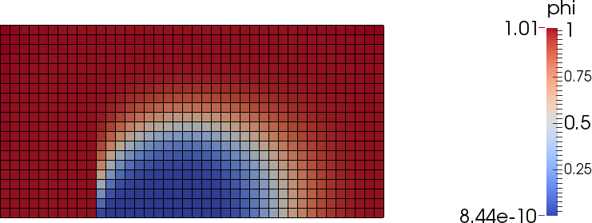

.. _testoperators:

Testing the operators
=====================

* :ref:`convection`

* :ref:`diffusion`

* :ref:`diffusionnonconj`

.. _convection:

Convection
----------

The convection problem is described by the following equation:

.. math::

    \frac{\partial \phi}{\partial t} + \nabla \cdot \left( \vec{v} \phi \right)
    = 0

This equation is solved for the Simth-Hutton problem. In this problem a constant
velocity field is prescribed which is given by:

.. math::

    u &= 2 y (1-x^2) \\
    v &= -2 x (1-y^2)

The mesh and boundary conditions for :math:`\phi` are shown on the next image:

The following parameters were set for the calculation of this problem:

* timestep: 0.05 s

* calculation time: 4 s

* initial value for :math:`\phi`: 1

The whole :ref:`smithhuttonscript`.

Divergence was calculated with :class:`pyCFD_operators.implicit_operators.Divergence`. The problem was
solved with the three available interpolation schemes: upwind (UDS), MINMOD and
STOIC.

Solution of the Smith-Hutton problem using UDS:

Solution of the Smith-Hutton problem using MINMOD:

Solution of the Smith-Hutton problem using STOIC:

Comparison of distributions of :math:`\phi` at the outlet:

Convergence history for the three cases:

Residual was calculated as :math:`max_i\left( \phi_i^{new} - \phi_i^{old}\right)`,
where i=1... # of cells.

.. _diffusion:

Diffusion
---------

The diffusion problem is described by the following equation:

.. math::

    - \nabla \cdot \left(\Gamma \nabla \phi \right) = S

In this test case :math:`S = 0` and a transient term is applied that the
explicit operator can be also tested. The final equation solved is therefore:

.. math::

    \frac{\partial \phi}{\partial t}
    - \nabla \cdot \left(\Gamma \nabla \phi \right) = 0

The same geometry is used as in the Smith-Hutton problem with different boundary
conditions:

The following parameters were set for the calculation of the problem:

* timestep: 0.1 s

* calculation time: 1 s

* initial value for :math:`\phi`: 0

The whole :ref:`smithhuttondiffscript`.

Diffusion was calculated with :class:`pyCFD_operators.implicit_operators.Laplace`.

Solution of the diffusion problem:

Convergence history for the diffusion case:

Residual was calculated as :math:`max_i\left( \phi_i^{new} - \phi_i^{old}\right)`,
where i=1... # of cells.

.. _diffusionnonconj:

Diffusion with correction for non conjunctionality
--------------------------------------------------

The following diffusion equation is solved:

.. math::

    \frac{\partial \phi}{\partial t}
    - \nabla \cdot \left(\Gamma \nabla \phi \right) = 0

The mesh and boundary conditions for :math:`\phi` are shown on the next image:

The following parameters were set for the calculation of the problem:

* timestep: 0.1 s

* calculation time: 3 s

* initial value for :math:`\phi`: 0

* :math:`\Gamma` = 0.01 (has the effect of under relaxation for this case)

The whole :ref:`inclineddiffscript`.

Solution of the diffusion problem without correction for non-conjunctionality:

Solution of the diffusion problem with correction for non-conjunctionality:

Convergence history for the diffusion case:

Residual was calculated as :math:`max_i\left( \phi_i^{new} - \phi_i^{old}\right)`,
where i=1... # of cells.

