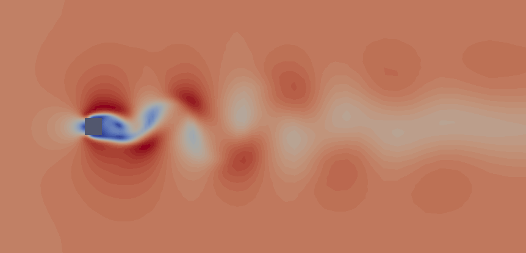

.. pyCFD documentation master file, created by
   sphinx-quickstart on Sun Apr 20 19:03:34 2014.
   You can adapt this file completely to your liking, but it should at least
   contain the root `toctree` directive.

Flow around a square cylinder
=============================

Contents:
---------

1. :ref:`introduction`
2. :ref:`codeintroduction`
3. :ref:`testoperators`
4. :ref:`nondim`
5. :ref:`simple`
6. :ref:`solution`

.. toctree::
   :maxdepth: 2

Indices and tables
==================

* :ref:`genindex`
* :ref:`modindex`
* :ref:`search`

